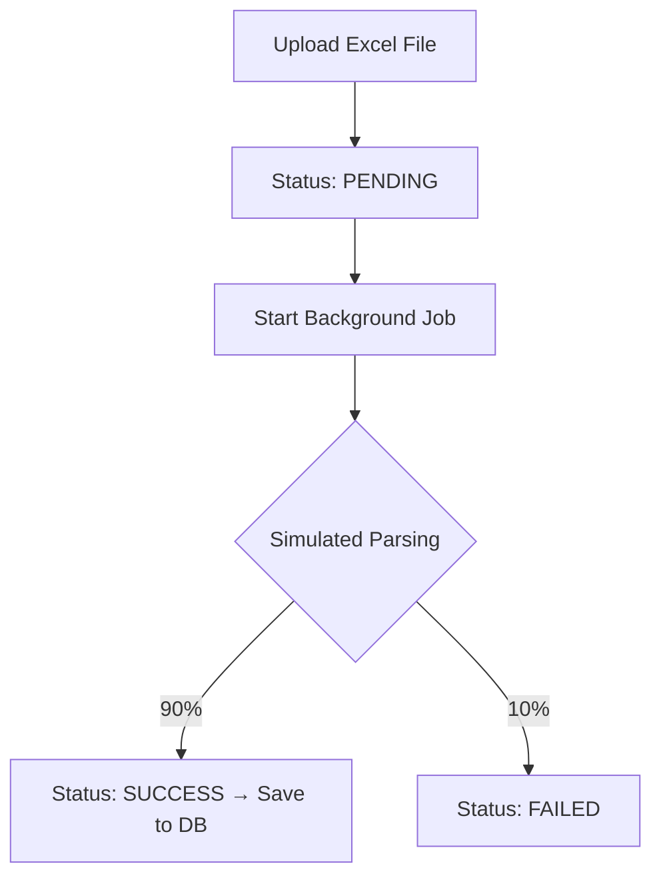

# Node Wave Base Repositories for Backend

## Tech Stack

* **Language**: TypeScript
* **Framework**: Express.js
* **ORM**: Prisma
* **Database**: MySQL
* **Logging**: Winston + Morgan

> ⚠️ **Note:** Ensure your environment includes:
>
> * Node.js ≥ 16.14.2
> * MySQL ≥ 8.0.3

---

## Features Overview

### Authentication

* Secure user authentication using **JWT**
* Endpoints for **user registration** and **login**

### Excel File Upload & Processing

* Upload Excel files (mocked: Products, Persons, Sales)
* Files are processed asynchronously in the background
* Statuses: `PENDING → PROCESSING → SUCCESS/FAILED`

### File Management

* Retrieve uploaded files with **pagination** and **filtering**
* View details for a specific file

### Data Storage

* Structured database schema:

  * `User`
  * `FileUpload`
  * `ProductData`
  * `PersonData`
  * `SalesData`
* Proper entity relationships and indexing

---

## Documentation & Deliverables

This repository includes:

* ✅ **Full Backend API** implementation
* ✅ **JWT Auth System** with middleware protection
* ✅ **Excel Processing** with background job logic
* ✅ **Filtering & Pagination** on file endpoints
* ✅ **Postman Collection**: `be-test-nodewave.postman_collection.json`
* ✅ **API Docs**

---

## Background Job Flow



---

## Postman Testing Guide

1. Import `be-test-nodewave.postman_collection.json` to Postman
2. Set `BASE_URL` environment variable (default: `http://localhost:3150`)
3. Run `/auth/register` and `/auth/login` to obtain JWT
4. Use token to test file upload and processing endpoints
5. Try various filters and pagination queries

---

## API Endpoints

### Auth

| Method | Endpoint             | Description       |
| ------ | -------------------- | ----------------- |
| POST   | `/api/auth/register` | Register new user |
| POST   | `/api/auth/login`    | Login & get JWT   |

### 📤 Upload & Manage Files

| Method | Endpoint               | Description                  |
| ------ | ---------------------- | ---------------------------- |
| POST   | `/api/upload`          | Upload Excel file            |
| GET    | `/api/upload/files`    | List all uploaded files      |
| GET    | `/api/upload/file/:id` | View file processing details |

### Example Queries

```http
GET /api/upload/files?page=1&rows=5
GET /api/upload/files?status=SUCCESS
GET /api/data-check/products?page=1&limit=10
```

---

## Mock Excel Parser Logic

| Behavior        | Description                                       |
| --------------- | ------------------------------------------------- |
| File Detection  | Based on keywords: `products`, `sales`, `persons` |
| Simulated Delay | 1–3 seconds for background task                   |
| Success Rate    | 90% succeed, 10% fail                             |
| Sample Records  | Generates 3 rows per file                         |

---

## Database Schema Overview

* **User**: App users
* **FileUpload**: Uploaded files and their status
* **ProductData**: Mock product entries
* **PersonData**: Mock personal data
* **SalesData**: Mock sales records

All entities have proper **timestamps**, **foreign keys**, and **indexes** for optimized queries.

---

## Development Setup

```bash
# Clone & install dependencies
git clone <repo-url>
cd <repo>
npm install

# Setup environment
cp .env.example .env
# (update your database URL, JWT secret, etc.)

# Migrate DB
npx prisma migrate dev --name init

# Seed (optional)
npm run seed

# Start server
npm run dev -- --service=rest
```

---

##  Folder Structure Highlights

* `/controllers`: Parse request, call services, return response
* `/services`: Business logic and DB access
* `/entities`: Type definitions for each domain
* `/routes`: Route definitions per domain
* `/validations`: Request validation logic
* `/middlewares`: Auth, logging, etc.
* `/utils`: Helpers and global utilities
* `/pkg`: 3rd-party integrations (if any)

---
